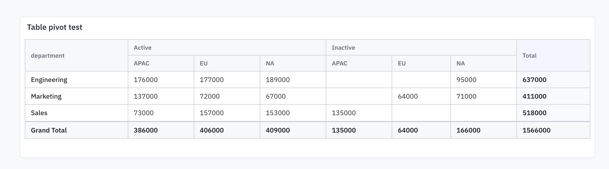

# ToolJet EE Custom Docker Build

Custom Docker image based on `tooljet/tooljet-ee:v3.20.126-lts` with the following additions:

- **Pyodide Packages** — Adds `openpyxl` and `et_xmlfile` to Pyodide for Python query support
- **Query Folders** — Adds folder management for organizing queries in the App Builder
- **Pivot Table** — Adds pivot table view to Table widgets with frontend and backend pivot support

---

## Quick Start

```bash
docker compose build --no-cache
docker compose up -d
docker logs -f Tooljet-app
```

## Prerequisites

- Docker & Docker Compose
- `.env` file with ToolJet configuration (PG_HOST, PG_USER, PG_PASS, PG_DB, SECRET_KEY_BASE, etc.)

---

## Pivot Table Feature

Adds configurable pivot table view to any Table widget. Developers configure the pivot in the editor's Inspector panel; end users see the aggregated report in the viewer.



### Capabilities

- **Editor mode**: Pivot Table config section in Inspector properties panel
  - Enable/disable pivot per table
  - Row Fields, Column Fields (ordered multi-select with drag tags)
  - Value Field + Aggregation (Count, Sum, Avg, Min, Max)
  - Title bar (toggle + alias)
  - Row Total, Grand Total, Subtotals (toggle + alias)
  - Backend Pivot toggle (auto-detected for SQL datasources)
- **Viewer mode**: Read-only pivot table replaces raw table data
- **Frontend Pivot**: Aggregates data extracted from DOM or intercepted API responses
- **Backend Pivot**: Wraps the original SQL query with `GROUP BY`, executes on the datasource via ToolJet's plugin system (supports MySQL, PostgreSQL, StarRocks, ClickHouse, etc.)
- Config persisted via REST API + localStorage fallback
- Multi-level column headers when multiple column fields selected
- Dark theme support

### Architecture

```
┌─────────────────────────────────────────────────────────┐
│ EE Docker Image                                         │
│                                                         │
│  Backend: pivot-table-config (NestJS Module)            │
│  ├── dist/src/modules/pivot-table-config/module.js      │
│  └── dist/ee/pivot-table-config/                        │
│       ├── controller.js  (REST API)                     │
│       ├── service.js     (CRUD + backend pivot exec)    │
│       ├── dto/index.js   (validation DTOs)              │
│       └── constants/index.js                            │
│                                                         │
│  Migration                                              │
│  └── dist/migrations/1760100000000-...js                │
│                                                         │
│  Frontend: pivot-table (Runtime Injection)               │
│  └── frontend/build/pivot-table/                        │
│       ├── inject.js      (DOM injection + pivot engine) │
│       └── inject.css     (styles)                       │
└─────────────────────────────────────────────────────────┘
```

### How It Works

**Frontend Pivot (default):**
1. Script injects "Pivot Table" accordion section into Inspector when a Table widget is selected
2. Developer configures Row/Column/Value fields and aggregation
3. Data extracted from table DOM (editor) or intercepted API responses (viewer)
4. Pivot computation + rendering done in-browser

**Backend Pivot (auto-detected for SQL datasources):**
1. Backend reads the Table widget's `dataSourceSelector` binding to find the linked data query
2. Reads the original SQL from `data_queries` table
3. Wraps with `SELECT ... GROUP BY ... ORDER BY ...` based on pivot config
4. Resolves datasource credentials from `data_source_options` (encrypted, per-environment)
5. Executes via ToolJet's plugin system (`@tooljet/plugins/dist/server`) — same drivers, connection pooling, SSL support
6. Returns aggregated rows to frontend for rendering

**Config Storage:**
- Primary: REST API → `pivot_table_configs` table (PostgreSQL)
- Fallback: localStorage (for offline/migration)
- In-memory cache for instant access during editing

### API Endpoints

| Method | Path | Description |
|--------|------|-------------|
| `GET` | `/api/pivot-table-config/:appVersionId` | Get all pivot configs for an app version |
| `GET` | `/api/pivot-table-config/:appVersionId/:componentName` | Get config for a specific component |
| `PUT` | `/api/pivot-table-config` | Upsert a pivot config |
| `POST` | `/api/pivot-table-config/detect` | Check if backend pivot is supported for a component |
| `POST` | `/api/pivot-table-config/execute` | Execute backend pivot query |

### Database Schema

```sql
CREATE TABLE pivot_table_configs (
  id              UUID PRIMARY KEY DEFAULT gen_random_uuid(),
  app_version_id  UUID NOT NULL,
  component_name  VARCHAR(255) NOT NULL,
  config          JSONB NOT NULL DEFAULT '{}',
  created_at      TIMESTAMPTZ DEFAULT NOW(),
  updated_at      TIMESTAMPTZ DEFAULT NOW(),
  UNIQUE (app_version_id, component_name)
);
```

### Pivot Config Object

```json
{
  "enabled": true,
  "rowFields": ["department", "region"],
  "colFields": ["status"],
  "valueField": "salary",
  "aggregator": "sum",
  "showTitle": true,
  "titleAlias": "Sales Report",
  "showRowTotal": true,
  "rowTotalLabel": "Total",
  "showGrandTotal": true,
  "grandTotalLabel": "Grand Total",
  "showSubtotal": true,
  "subtotalLabel": "Subtotal",
  "backendPivot": true
}
```

---

## StarRocks (Test Database)

A StarRocks instance is included for testing backend pivot with OLAP data.

### Connection Details

| Property | Value |
|----------|-------|
| Host | `starrocks` (from within Docker network) |
| Port | `9030` |
| Username | `root` |
| Password | (empty) |
| Database | `demo` |

### Seed Data

Automatically seeded on first startup via `starrocks-seed` service:

**`demo.employees`** (20 rows)

| Column | Type | Example Values |
|--------|------|---------------|
| id | INT | 1-20 |
| name | VARCHAR | Olivia Nguyen, Liam Patel |
| department | VARCHAR | Engineering, Marketing, Sales |
| region | VARCHAR | APAC, NA, EU |
| status | VARCHAR | Active, Inactive |
| salary | DECIMAL | 64000-97000 |
| hire_date | DATE | 2021-01 to 2023-06 |

**`demo.sales_orders`** (30 rows)

| Column | Type | Example Values |
|--------|------|---------------|
| id | INT | 1-30 |
| order_date | DATE | 2024-01 to 2024-06 |
| customer | VARCHAR | Acme Corp, Beta Ltd, ... |
| product_category | VARCHAR | Electronics, Furniture, Software |
| product | VARCHAR | Laptop Pro, Office Chair, CRM License |
| region | VARCHAR | APAC, NA, EU |
| channel | VARCHAR | Online, Store |
| quantity | INT | 2-60 |
| unit_price | DECIMAL | 100-1200 |
| total_amount | DECIMAL | 1600-9000 |

### Testing Pivot Table

1. In ToolJet, add a **MySQL** datasource: host=`starrocks`, port=`9030`, user=`root`, database=`demo`
2. Create a query: `SELECT * FROM employees` or `SELECT * FROM sales_orders`
3. Bind to a Table widget via `dataSourceSelector`
4. Select the Table → scroll to **Pivot Table** section in Inspector
5. Enable Pivot → configure Row/Column/Value fields
6. Toggle **Backend Pivot** (auto-appears for SQL datasources)
7. Open viewer mode to see the report

---

## Query Folders Feature

Adds hierarchical folder organization to ToolJet's Query Panel in the App Builder.


### Capabilities

- Create, rename, and delete folders
- Nested folder hierarchy (subfolders)
- Drag-and-drop queries between folders
- Right-click context menu on folders
- Filter query list by folder
- "Ungrouped" default folder auto-created per app version
- New queries automatically assigned to "Ungrouped"
- Persists across page refreshes

### API Endpoints

| Method | Path | Description |
|--------|------|-------------|
| `GET` | `/api/query-folders/:appVersionId` | List all folders |
| `GET` | `/api/query-folders/queries/:appVersionId` | Get query-folder mappings |
| `POST` | `/api/query-folders` | Create a folder |
| `POST` | `/api/query-folders/ensure-default/:appVersionId` | Create "Ungrouped" folder |
| `PUT` | `/api/query-folders/move-query` | Move a query to a folder |
| `PUT` | `/api/query-folders/move-queries-bulk` | Bulk move queries |
| `PUT` | `/api/query-folders/:id` | Rename or move a folder |
| `DELETE` | `/api/query-folders/:id` | Delete a folder |

---

## File Structure

```
tooljet-demo/
├── Dockerfile
├── docker-compose.yaml
├── .env
├── custom-license/
│   ├── License-EE.js
│   └── License.js
├── scripts/
│   └── add_pyodide_package.py
├── query-folders/
│   ├── dist/                         # Pre-built backend JS
│   │   ├── module.js
│   │   ├── ee/ (controller, service, dto, constants)
│   │   └── migrations/
│   ├── patch-app-module.js
│   ├── entrypoint.sh                 # Runtime: injects frontend scripts
│   ├── inject.js
│   └── inject.css
├── pivot-table/
│   ├── inject.js                     # Frontend: Inspector UI + pivot engine
│   └── inject.css                    # Frontend: styles
├── pivot-table-config/
│   ├── dist/                         # Pre-built backend JS
│   │   ├── module.js
│   │   ├── ee/ (controller, service, dto, constants)
│   │   └── migrations/
│   └── patch-app-module.js
├── starrocks/
│   ├── seed.sql                      # Demo tables + data
│   └── seed-entrypoint.sh
└── postgres_data/                    # Persistent database volume
```

## Updating ToolJet Version

1. Change `FROM tooljet/tooljet-ee:vX.XX.XX-lts` in `Dockerfile`
2. Update `image:` in `docker-compose.yaml`
3. Rebuild: `docker compose build --no-cache`
4. The `patch-app-module.js` scripts are designed to be resilient to minor changes

> **Note:** Major version updates may require verifying that the `dist/ee/` directory structure and import paths haven't changed.

## Troubleshooting

**Container restart loop:**
Check `docker logs Tooljet-app` for errors. Common issues:
- Missing `.env` file or incorrect database credentials
- Module import path changes in a new ToolJet version

**Pivot Table not showing in Inspector:**
- Select a Table widget → scroll down in Properties tab
- Check browser console for `[PivotTable]` logs
- Ensure `appVersionId` is captured: look for `Backend detect: versionId=`

**Backend Pivot errors:**
- Check `docker logs Tooljet-app 2>&1 | grep PivotTable` for server-side logs
- Verify datasource credentials are configured for the correct environment (development vs production)
- Ensure StarRocks/MySQL is reachable from the ToolJet container

**401 Unauthorized on API:**
- Ensure you're logged in to ToolJet
- Check that `tj-workspace-id` header is being captured

**Migration errors:**
- Check `docker logs Tooljet-app` for TypeORM migration output
- Migrations are idempotent (use `IF NOT EXISTS`)
