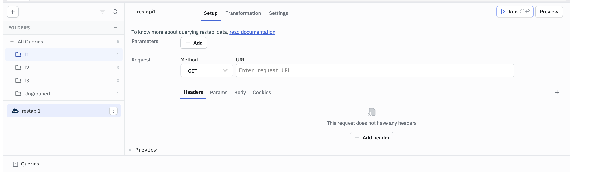

# ToolJet EE Custom Docker Build

Custom Docker image based on `tooljet/tooljet-ee:v3.20.60-lts` with the following additions:

- **Pyodide Packages** — Adds `openpyxl` and `et_xmlfile` to Pyodide for Python query support
- **Query Folders** — Adds folder management for organizing queries in the App Builder

---

## Quick Start

```bash
cd tooljet-docker-custom
docker compose build --no-cache
docker compose up -d
docker logs -f Tooljet-app
```

## Prerequisites

- Docker & Docker Compose
- `.env` file with ToolJet configuration (PG_HOST, PG_USER, PG_PASS, PG_DB, SECRET_KEY_BASE, etc.)

---

## Query Folders Feature

Adds hierarchical folder organization to ToolJet's Query Panel in the App Builder.



### Capabilities

- Create, rename, and delete folders
- Nested folder hierarchy (subfolders)
- Drag-and-drop queries between folders
- Right-click context menu on folders
- Filter query list by folder
- "Ungrouped" default folder auto-created per app version
- New queries automatically assigned to "Ungrouped"
- Persists across page refreshes

### Architecture

```
┌─────────────────────────────────────────────────┐
│ EE Docker Image (tooljet-ee:v3.20.60-lts)       │
│                                                   │
│  Backend (NestJS Module)                          │
│  ├── dist/src/modules/query-folders/module.js     │ ← Module registration
│  └── dist/ee/query-folders/                       │ ← Controller, Service, DTOs
│       ├── controller.js                           │
│       ├── service.js                              │
│       ├── dto/index.js                            │
│       └── constants/index.js                      │
│                                                   │
│  Database Migration                               │
│  └── dist/migrations/1760000000000-...js          │ ← TypeORM migration
│                                                   │
│  Frontend (Runtime Injection)                     │
│  └── frontend/build/query-folders/                │
│       ├── inject.js                               │ ← DOM injection script
│       └── inject.css                              │ ← Styles
│                                                   │
│  App Module Patch                                 │
│  └── patch-app-module.js                          │ ← Build-time patch
└─────────────────────────────────────────────────┘
```

### How It Works

**Backend:**
- Pre-compiled NestJS module (hand-written CommonJS) placed directly in the EE image
- `module.js` at `dist/src/modules/` extends `SubModule` for NestJS dynamic module registration
- Controller/Service at `dist/ee/` for EE edition dynamic loading via `SubModule.getProviders()`
- Uses raw SQL via TypeORM's `EntityManager` — no entity modifications needed
- `patch-app-module.js` runs at Docker build time to register `QueryFoldersModule` in the EE app module

**Database:**
- TypeORM migration creates `query_folders` table and adds `folder_id` column to `data_queries`
- Migration runs automatically via the EE entrypoint (`npm run db:migrate:prod`)

**Frontend:**
- Vanilla JS injection script loaded via `<script>` tag injected into `index.html` at container startup
- Uses `MutationObserver` to detect when the query panel renders and injects the folder UI
- Intercepts `fetch()` calls to capture `tj-workspace-id` header and `appVersionId` from ToolJet API calls
- Auth uses httpOnly cookie (`tj_auth_token`) via `credentials: 'include'`

### API Endpoints

| Method | Path | Description |
|--------|------|-------------|
| `GET` | `/api/query-folders/:appVersionId` | List all folders |
| `GET` | `/api/query-folders/queries/:appVersionId` | Get query-folder mappings |
| `POST` | `/api/query-folders` | Create a folder |
| `POST` | `/api/query-folders/ensure-default/:appVersionId` | Create "Ungrouped" folder + assign unassigned queries |
| `PUT` | `/api/query-folders/move-query` | Move a query to a folder |
| `PUT` | `/api/query-folders/move-queries-bulk` | Bulk move queries |
| `PUT` | `/api/query-folders/:id` | Rename or move a folder |
| `DELETE` | `/api/query-folders/:id` | Delete a folder (queries moved to "Ungrouped") |

### Database Schema

```sql
-- New table
CREATE TABLE query_folders (
  id              UUID PRIMARY KEY DEFAULT gen_random_uuid(),
  name            VARCHAR(255) NOT NULL,
  parent_id       UUID REFERENCES query_folders(id) ON DELETE CASCADE,
  app_version_id  UUID NOT NULL,
  organization_id UUID NOT NULL,
  created_at      TIMESTAMPTZ DEFAULT NOW(),
  updated_at      TIMESTAMPTZ DEFAULT NOW(),
  UNIQUE(name, parent_id, app_version_id)
);

-- Added column
ALTER TABLE data_queries ADD COLUMN folder_id UUID REFERENCES query_folders(id) ON DELETE SET NULL;
```

---

## File Structure

```
tooljet-demo/
├── Dockerfile
├── docker-compose.yaml
├── .env                          # Your environment variables
├── custom-license/
│   ├── License-EE.js
│   └── License.js
├── scripts/
│   └── add_pyodide_package.py
├── query-folders/
│   ├── dist/                     # Pre-built backend JS (no compilation needed)
│   │   ├── module.js             # → /app/server/dist/src/modules/query-folders/
│   │   ├── ee/                   # → /app/server/dist/ee/query-folders/
│   │   │   ├── controller.js
│   │   │   ├── service.js
│   │   │   ├── dto/index.js
│   │   │   └── constants/index.js
│   │   └── migrations/
│   │       └── 1760000000000-CreateQueryFolders.js
│   ├── patch-app-module.js       # Build-time: patches EE app module
│   ├── entrypoint.sh             # Runtime: injects frontend, calls EE entrypoint
│   ├── inject.js                 # Frontend injection script
│   └── inject.css                # Frontend styles
└── postgres_data/                # Persistent database volume
```

## Updating ToolJet Version

To update the base EE image version:

1. Change `FROM tooljet/tooljet-ee:vX.XX.XX-lts` in `Dockerfile`
2. Update `image:` in `docker-compose.yaml`
3. Rebuild: `docker compose build --no-cache`
4. The `patch-app-module.js` script is designed to be resilient to minor changes in the compiled app module

> **Note:** Major version updates may require verifying that the `dist/ee/` directory structure and import paths haven't changed.

## Troubleshooting

**Container restart loop:**
Check `docker logs Tooljet-app` for errors. Common issues:
- Missing `.env` file or incorrect database credentials
- Module import path changes in a new ToolJet version

**401 Unauthorized on query-folders API:**
- Ensure you're logged in to ToolJet
- Check that `tj-workspace-id` header is being captured (look for `[QueryFolders] Captured version ID` in browser console)

**Folders not loading / queries ungrouped after refresh:**
- Check browser console for `[QueryFolders] Loaded: X folders, Y query mappings`
- Verify the version ID is correct: `[QueryFolders] Captured version ID from data-queries: <uuid>`

**Migration errors:**
- Check `docker logs Tooljet-app` for TypeORM migration output
- The migration is idempotent (uses `IF NOT EXISTS`)
